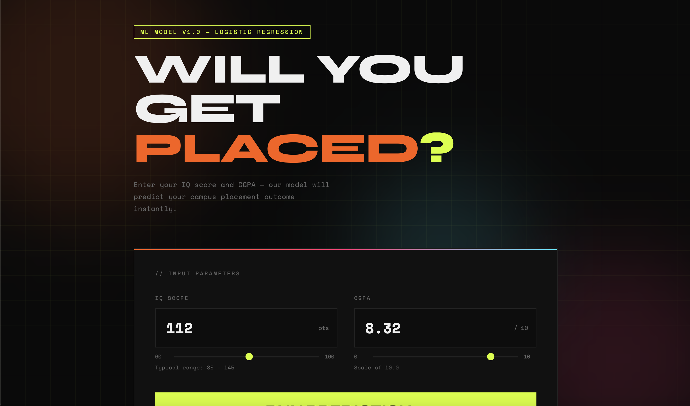

# PlaceIQ — Student Placement Predictor

## Demo



A bold, colorful web app powered by your logistic regression model.

## Setup & Run

1. **Install dependencies**
   ```bash
   pip install -r requirements.txt
   ```

2. **Make sure `model.pkl` is in the same folder as `app.py`**

3. **Run the Flask server**
   ```bash
   python app.py
   ```

4. **Open your browser at** → http://localhost:5000

## Project Structure
```
placement-app/
├── app.py              ← Flask backend + prediction API
├── model.pkl           ← Your trained logistic regression model
├── requirements.txt    ← Python dependencies
├── README.md
└── templates/
    └── index.html      ← Full frontend (HTML/CSS/JS)
```

## How it works
- User adjusts IQ (70–160) and CGPA (0–10) sliders
- Frontend sends POST request to `/predict`
- Flask loads your .pkl model and returns placement prediction + probability
- UI displays result with animated probability bar and confidence score
